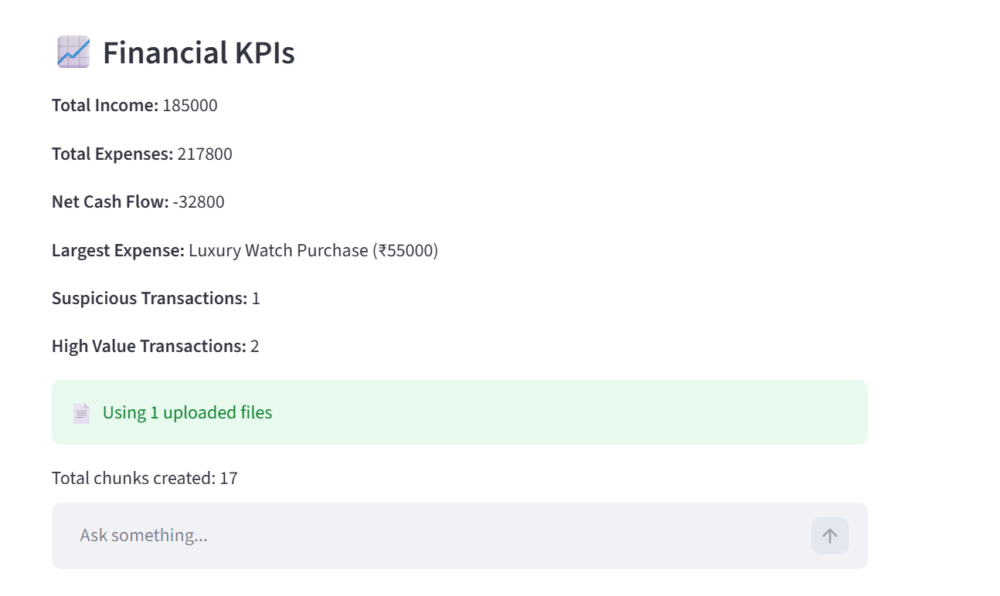
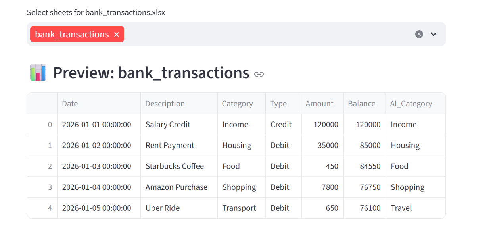
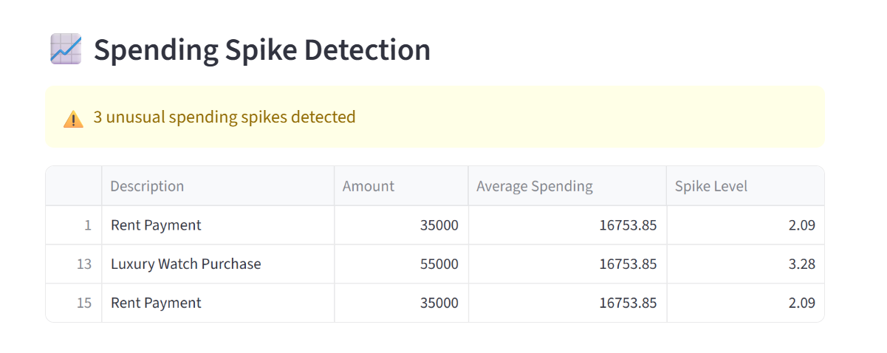
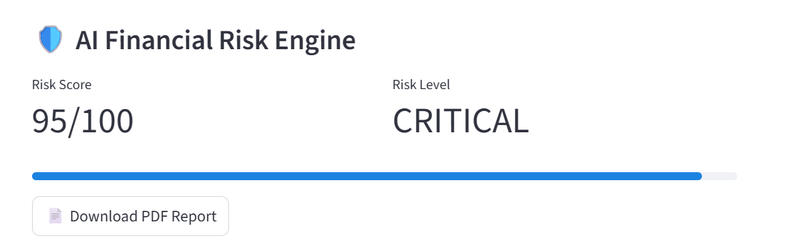
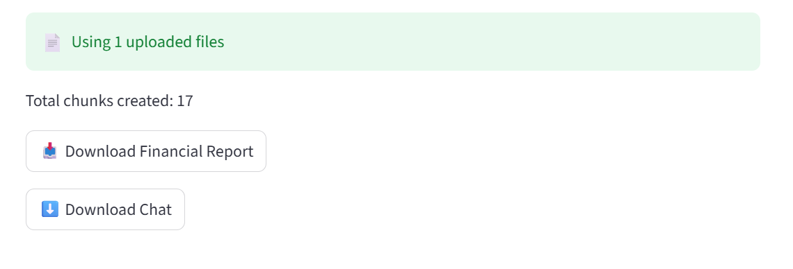

# Financial Document Intelligence System

## Live Demo

🔗 https://financial-document-intelligence-system-xkmrzm9kmyyn45phuzxqy8.streamlit.app/

## GitHub Repository

🔗 https://github.com/ekta-k2026/financial-document-intelligence-system

## Overview

Financial Document Intelligence System is an AI-powered fintech platform that analyzes financial documents, extracts insights, detects fraud patterns, performs risk assessment, and answers financial questions using Retrieval-Augmented Generation (RAG).

The system supports:

* Excel financial statements
* PDF documents
* Scanned PDF documents using OCR
* AI-powered financial analytics
* Fraud detection
* Risk intelligence

---

## Features

### Financial Analytics

* KPI extraction
* Income analysis
* Expense analysis
* Cash flow analysis
* Transaction categorization

### Fraud Detection

* Suspicious transaction detection
* Spending spike detection
* Recurring transaction intelligence
* Explainable AI fraud analysis

### Risk Intelligence

* Financial risk scoring
* Risk level classification
* Risk visualization dashboard

### OCR Support

* Tesseract OCR integration
* Scanned PDF processing
* Financial text extraction

### AI Capabilities

* RAG-based financial chatbot
* Semantic document search
* Context-aware financial Q&A

### Reporting

* Financial report generation
* PDF report download

---

## Architecture

Upload File

↓

OCR (Tesseract)

↓

Text Extraction

↓

Chunking

↓

Embedding Generation

↓

Vector Search

↓

LLM Analysis

↓

Dashboard

↓

Fraud Engine

↓

Risk Engine

---

## Tech Stack

* Python
* Streamlit
* OpenAI
* FAISS
* Pandas
* Tesseract OCR
* Poppler
* ReportLab
* NumPy

---

## Screenshots

### Dashboard

### Fraud Detection

### Spending Spikes

### Risk Engine

### OCR Processing

---

## Future Improvements

* Multi-bank statement analysis
* Investment intelligence
* Advanced anomaly detection
* Real-time fraud monitoring
* Cloud deployment

---

## Author

Ekta Khamkar
